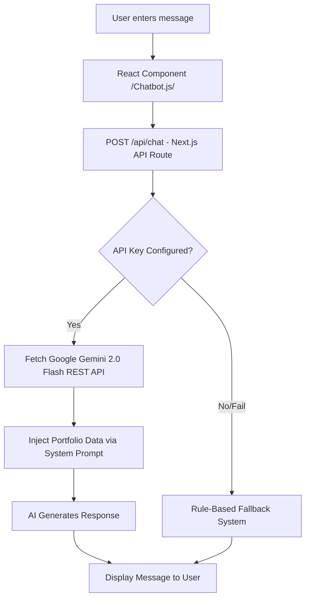

# 🚀 Satyaverse — Professional Developer Portfolio

Welcome to the official repository of **Satya Prakash's** digital universe. This portfolio is built with modern web technologies and features an intelligent AI assistant to provide an interactive experience for recruiters and visitors.

---

## 🤖 AI Chatbot Architecture

The heart of this portfolio is an AI-driven assistant that answers questions about Satya's professional background in real-time.

### 🔧 How It Works (Technical Workflow)



### 💎 Key Technical Features
- **Engine**: Google Gemini 2.0 Flash (REST Integration).
- **Lightweight Architecture**: No heavy SDKs; uses native `fetch()` for faster performance and smaller bundle size.
- **Fail-Safe Mechanism**: Automatic fallback to a keyword-based rule system if API quota is reached or service is down.
- **Context Injection**: Uses a comprehensive system prompt that feeds the AI the entire `portfolioData` object for high-accuracy answers.

---

## 💼 Interviewer's Guide (Q&A)

*Prepare for technical discussions regarding this project.*

### 🛠 Implementation Details
**Q: How did you implement the AI chatbot in your portfolio?**  
> "I built a custom floating UI using React and Framer Motion. The backend is a Next.js API route that communicates directly with the Google Gemini REST API using `fetch()`. This zero-dependency approach avoids version conflicts and keeps the application lightweight. The knowledge base is a structured system prompt that includes my full professional context—projects, impact metrics, and technical skills."

**Q: Why Gemini over OpenAI for this project?**  
> "Gemini offers a generous free tier perfect for a personal portfolio. Additionally, its REST API is incredibly easy to integrate without pulling in large external libraries, which helped me keep the Core Web Vitals (LCP/FID) optimized."

### 🛡 Security & Resilience
**Q: What happens if the AI API fails?**  
> "I implemented a robust 'Keyword Fallback' system. If the API returns an error (like a 429 Quota limit), the server-side logic automatically switches to predefined responses. This ensures the user always gets a relevant answer about my skills or contact info."

**Q: How are you securing your API keys?**  
> "All secrets are managed via Environment Variables (`.env.local`). The key is only accessed on the server (Next.js API route), meaning it is never exposed to the client-side browser, preventing any unauthorized usage."

---

## 🏛 Kaise Kaam Karta Hai? (Hinglish Version)

1. **Frontend (Chatbot.js)**: Aap jo message type karte hain, yeh component usse capture karke backend `/api/chat` ko bhejta hai.
2. **Backend (route.js)**: Yeh server pe safely chalta hai aur Google Gemini AI se baat karta hai.
3. **AI Brain (data.js)**: Gemini ko pehle se hi briefing di gayi hai (System Prompt) ki Satya ne kya projects banaye hain aur uske stats (like 66* runs in cricket) kya hain.
4. **Fallback**: Agar AI busy ho, toh system automatically keyword-based answers dena shuru kar deta hai taaki website kabhi break na lage.

---

## 🛠 Tech Stack
- **Framework**: Next.js 16 (App Router)
- **Styling**: Tailwind CSS
- **Animations**: Framer Motion
- **AI**: Google Gemini 2.0 Flash
- **Icons/UI**: Lucide React / Glassmorphism Design

## ⚡ Quick Start
```bash
# Clone the repository
git clone https://github.com/coderSatya/satya_portfolio.git

# Install dependencies
npm install

# Setup .env.local
GEMINI_API_KEY=your_key_here

# Run development server
npm run dev
```

---
Built with ❤️ by [Satya Prakash](https://linkedin.com/in/satya-prakash-sp)
